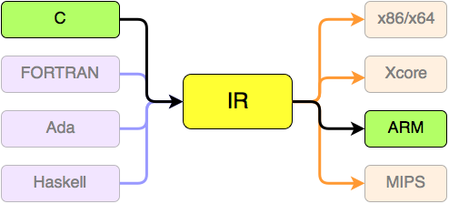

<i>Notes from [this article](https://blog.usejournal.com/writing-your-own-programming-language-and-compiler-with-python-a468970ae6df).</i>

While this is starting as a project to better understand programs, compilers and stuff, I am hoping that over the course of next few months, I can develop something worthwhile. I want to mostly develop a Python-like language with Static data types and curly brackets. Native modules for stuff like I/O and easy package management with the robustness of C++ is what I'm going for, with stuff like collections from Java and lack of dependency hell from Go. I enjoy all these languages, and I hope I can make something. But if my lockdown attempts at cooking have taught me something, it is this: the final result doesn't always turn out well in the first try.

## Setup
Download Conda, I personally use Miniconda. 
`conda install --channel=numba llvmlite`
`conda install -c conda-forge rply`

## Extended BNF

EBNF is a metasyntax for CFGs. For `4+2;` , we define the EBNF as 
```
expression = number, "+", number, ";";
number = digit+;
digit = [0-9];
```

## Compiler

Edge gets converted to LLVM Intermediate Representation

>Using LLVM, it is possible to optimize your compilation without learning compiling optimization, and LLVM has a really good library to work with compilers.

3 components of the compiler are: Lexer, Parser, Code Generator. Let's talk about them.


### Lexer

We will use RPLY's Lexer Generator and describe a Class to add tokens. 

```python
   def _add_tokens(self):
        # Print
        self.lexer.add('PRINT', r'print')
        # Parenthesis
        self.lexer.add('OPEN_PAREN', r'\(')
        self.lexer.add('CLOSE_PAREN', r'\)')
        # Semi Colon
        self.lexer.add('SEMI_COLON', r'\;')
        # Operators
        self.lexer.add('SUM', r'\+')
        self.lexer.add('SUB', r'\-')
        # Number
        self.lexer.add('NUMBER', r'\d+')
        # Ignore spaces
        self.lexer.ignore('\s+')
```

We added Lexical Generator for `()`, `+`, `-` and stuff. Then we call this in `main.py`, and then for a text input we process it lexically.

### Parser

You can read more about ASTs [here](https://dev.to/abhinavmir/from-source-to-binaries-the-journey-of-a-c-program-4hlj). The parser takes a list of tokens and puts out an AST. We will create a class for every command. Here's an example.
```python
class Number():
    def __init__(self, value):
        self.value = value

    def eval(self):
        return int(self.value)
```

Here's an example of an operator

```python
class Sum(BinaryOp):
    def eval(self):
        return self.left.eval() + self.right.eval()
```

Now, we need a parser, for you know, parsing. We can use RPLY's ParserGenerator. Refer to `parser.py`.

```python
from rply import ParserGenerator
from ast import Number, Sum, Sub, Print


class Parser():
    def __init__(self):
        self.pg = ParserGenerator(
            # A list of all token names accepted by the parser.
            ['NUMBER', 'PRINT', 'OPEN_PAREN', 'CLOSE_PAREN',
             'SEMI_COLON', 'SUM', 'SUB']
        )

    def parse(self):
        @self.pg.production('program : PRINT OPEN_PAREN expression CLOSE_PAREN SEMI_COLON')
        def program(p):
            return Print(p[2])

        @self.pg.production('expression : expression SUM expression')
        @self.pg.production('expression : expression SUB expression')
        def expression(p):
            left = p[0]
            right = p[2]
            operator = p[1]
            if operator.gettokentype() == 'SUM':
                return Sum(left, right)
            elif operator.gettokentype() == 'SUB':
                return Sub(left, right)

        @self.pg.production('expression : NUMBER')
        def number(p):
            return Number(p[0].value)

        @self.pg.error
        def error_handle(token):
            raise ValueError(token)

    def get_parser(self):
        return self.pg.build()
```

And then we need to add this to the main file.

```python
pg = Parser()
pg.parse()
parser = pg.get_parser()
parser.parse(tokens).eval()
```

